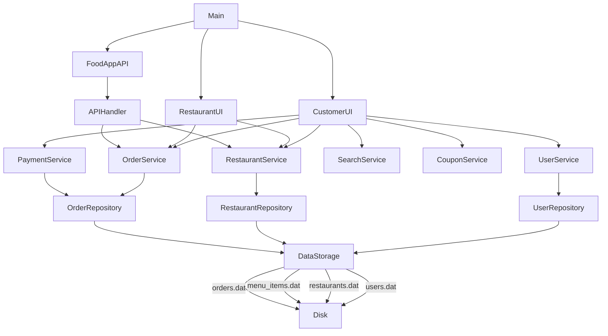
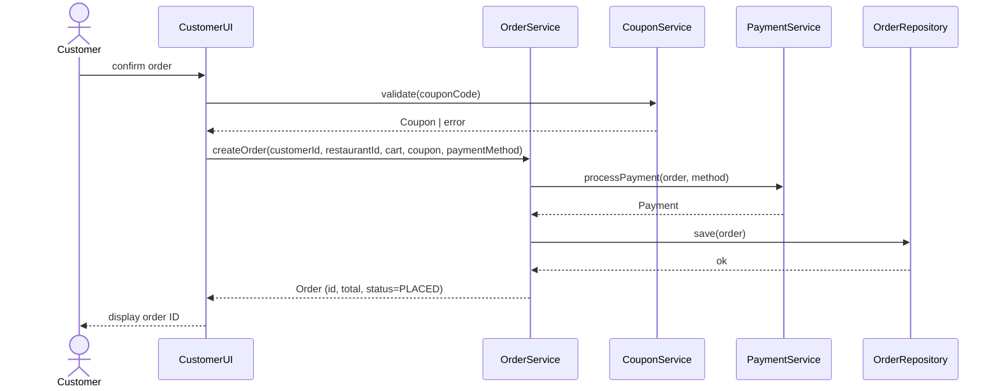
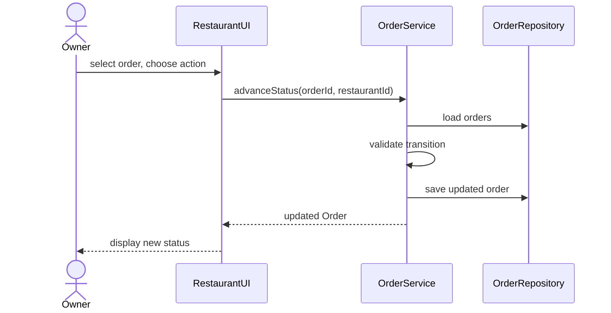
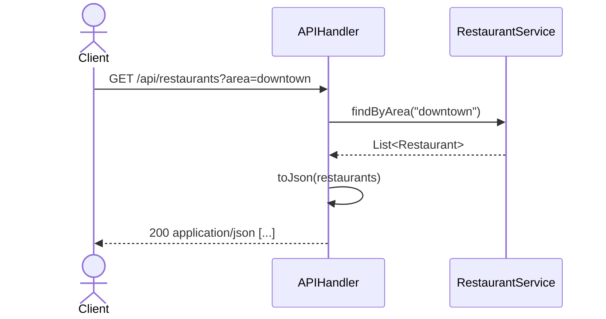

# Design Document: Food Delivery Application

## Overview

A Java 17 console application with an embedded HTTP server. Two console UIs (CustomerUI, RestaurantUI) share a common service and repository layer. All state is persisted to `.dat` files via Java object serialization. An HTTP server on port 8000 exposes a read-only JSON API.

The application has no external dependencies beyond the JDK. `com.sun.net.httpserver` provides the HTTP layer. All persistence is handled through a `DataStorage` interface backed by `ObjectOutputStream`/`ObjectInputStream`.

---

## Architecture



**Layer responsibilities:**

- `ui/` — console I/O only; delegates all logic to services
- `service/` — business logic; no I/O, no direct file access
- `repository/` — serialization/deserialization; no business logic
- `model/` — plain serializable POJOs
- `api/` — HTTP routing and JSON serialization; delegates to services

---

## Components and Interfaces

### model/

| Class | Key fields | Notes |
|---|---|---|
| `User` | `id`, `username`, `passwordHash`, `fullName`, `address` | `Serializable` |
| `Restaurant` | `id`, `name`, `address`, `cuisineType`, `contact`, `openingHour`, `closingHour`, `deliveryRadiusKm`, `averageRating`, `estimatedDeliveryMinutes`, `menuItems` | `Serializable` |
| `MenuItem` | `id`, `restaurantId`, `name`, `price`, `description`, `available`, `stockQuantity`, `customizationOptions` | `Serializable` |
| `Order` | `id`, `customerId`, `restaurantId`, `items`, `subtotal`, `deliveryFee`, `discount`, `total`, `status`, `paymentStatus`, `riderName`, `createdAt` | `Serializable` |
| `Payment` | `orderId`, `method`, `status` | `Serializable`; embedded in Order |
| `Coupon` | `code`, `discountPercent`, `active` | `Serializable` |

Enums (inner or top-level):
- `OrderStatus`: `PLACED`, `PREPARING`, `READY`, `DELIVERED`
- `PaymentMethod`: `CASH_ON_DELIVERY`, `CARD`
- `PaymentStatus`: `PENDING`, `COMPLETED`

### repository/

```
DataStorage (interface)
  + save(Object data, String filePath): void
  + load(String filePath): Object

FileDataStorage (implements DataStorage)
  - uses ObjectOutputStream / ObjectInputStream
  - returns empty ArrayList when file absent
  - logs and rethrows on write failure

RestaurantRepository
  - save/load restaurants.dat  (List<Restaurant>)
  - save/load menu_items.dat   (List<MenuItem>)

OrderRepository
  - save/load orders.dat       (List<Order>)

UserRepository
  - save/load users.dat        (List<User>)
```

Each repository holds an in-memory list loaded at startup and flushes the full list on every mutation.

### service/

```
UserService
  + register(username, password, fullName, address): User
  + login(username, password): User
  - delegates persistence to UserRepository

RestaurantService
  + register(name, address, cuisine, contact, openHour, closeHour, radiusKm): Restaurant
  + findByArea(address): List<Restaurant>          // sorted by proximity
  + sortByRating(): List<Restaurant>
  + sortByDeliveryTime(): List<Restaurant>
  + sortByName(): List<Restaurant>
  + addMenuItem(restaurantId, ...): MenuItem
  + updateMenuItemAvailability(itemId, available): void
  + updateMenuItemStock(itemId, qty): void

OrderService
  + createOrder(customerId, restaurantId, cartItems, coupon, paymentMethod): Order
  + getOrder(orderId): Order
  + getOrdersByCustomer(customerId): List<Order>   // sorted by createdAt desc
  + advanceStatus(orderId, restaurantId): Order    // PLACED→PREPARING→READY
  + assignRider(orderId, riderName): Order         // READY→DELIVERED

PaymentService
  + processPayment(order, method): Payment

SearchService
  + searchRestaurants(query): List<Restaurant>
  + searchMenuItems(query): List<MenuItem>
  + filterAvailableItems(items): List<MenuItem>

CouponService
  + validate(code): Coupon
  + apply(coupon, subtotal): double
```

### api/

```
FoodAppAPI
  + start(port): void          // creates HttpServer, registers contexts

APIHandler
  + handle(HttpExchange): void
  // routes:
  //   GET /api/restaurants?area=
  //   GET /api/restaurant/{id}/menu
  //   GET /api/order/{id}/status
  - toJson(Object): String     // manual JSON serialization (no external libs)
```

### ui/

```
CustomerUI
  + start(): void
  // menu: Browse Restaurants | Search | View Cart | View Orders | Apply Coupon | Exit
  - cart: List<OrderItem>  (in-memory, session-scoped)

RestaurantUI
  + start(): void
  // menu: Manage Menu | View Orders | Update Order Status | Exit
```

### Main.java

Bootstraps repositories (loads .dat files), starts `FoodAppAPI`, then presents the top-level menu to launch `CustomerUI` or `RestaurantUI`.

---

## Data Models

### User
```java
public class User implements Serializable {
    private String id;           // UUID
    private String username;     // unique
    private String passwordHash; // SHA-256 hex
    private String fullName;
    private String address;
}
```

### Restaurant
```java
public class Restaurant implements Serializable {
    private String id;
    private String name;         // unique
    private String address;
    private String cuisineType;
    private String contact;
    private int openingHour;     // 0-23
    private int closingHour;     // 0-23
    private double deliveryRadiusKm;
    private double averageRating;
    private int estimatedDeliveryMinutes;
    private List<MenuItem> menuItems;
}
```

### MenuItem
```java
public class MenuItem implements Serializable {
    private String id;
    private String restaurantId;
    private String name;
    private double price;
    private String description;
    private boolean available;
    private int stockQuantity;
    private List<String> customizationOptions;
}
```

### Order
```java
public class Order implements Serializable {
    private String id;
    private String customerId;
    private String restaurantId;
    private List<OrderItem> items;
    private double subtotal;
    private double deliveryFee;
    private double discount;
    private double total;
    private OrderStatus status;
    private PaymentMethod paymentMethod;
    private PaymentStatus paymentStatus;
    private String riderName;
    private LocalDateTime createdAt;
}

public class OrderItem implements Serializable {
    private MenuItem menuItem;
    private int quantity;
}
```

### Payment
```java
public class Payment implements Serializable {
    private String orderId;
    private PaymentMethod method;
    private PaymentStatus status;
}
```

### Coupon
```java
public class Coupon implements Serializable {
    private String code;
    private int discountPercent; // 10 or 20
    private boolean active;
}
```

---

## Sequence Diagrams

### Place Order Flow



### Restaurant Advances Order Status



### API Request — GET /api/restaurants?area=



---

## Correctness Properties

*A property is a characteristic or behavior that should hold true across all valid executions of a system — essentially, a formal statement about what the system should do. Properties serve as the bridge between human-readable specifications and machine-verifiable correctness guarantees.*


### Property 1: Registration round-trip

*For any* username that does not already exist in the system, registering a new user with that username and then logging in with the same credentials should return the same user record.

**Validates: Requirements 1.1, 1.3**

---

### Property 2: Duplicate entity registration is rejected

*For any* username or restaurant name that is already registered, attempting to register again with the same name should fail with an error and leave the existing record unchanged.

**Validates: Requirements 1.2, 2.2**

---

### Property 3: Invalid credentials are rejected

*For any* registered user, logging in with any password other than the correct one should fail and return no session.

**Validates: Requirements 1.4**

---

### Property 4: Serialization round-trip

*For any* valid User, Restaurant, MenuItem, or Order object, saving it to a `.dat` file and then loading from that file should produce an object equal to the original.

**Validates: Requirements 1.5, 2.3, 6.5, 12.3, 14.2, 14.3, 14.4**

---

### Property 5: Area filter correctness

*For any* delivery address and any set of restaurants, every restaurant returned by `findByArea` should have a delivery radius that covers the given address, and no restaurant that covers the address should be absent from the result.

**Validates: Requirements 3.1**

---

### Property 6: Sort ordering invariant

*For any* non-empty list of restaurants, sorting by rating should produce a list where each element's rating is greater than or equal to the next; sorting by delivery time should produce a list where each element's delivery time is less than or equal to the next; sorting by name should produce a lexicographically non-decreasing list.

**Validates: Requirements 4.2, 4.3, 4.4**

---

### Property 7: Unavailable item cannot be added to cart

*For any* MenuItem with `available = false`, attempting to add it to the cart should be rejected and the cart should remain unchanged.

**Validates: Requirements 5.2**

---

### Property 8: Search filter correctness

*For any* case-insensitive query string and any backing data, every result returned by `searchRestaurants` should have a name or cuisine type containing the query, and every result returned by `searchMenuItems` should have a name containing the query; no matching entity should be absent from the results.

**Validates: Requirements 7.1, 7.2**

---

### Property 9: Availability filter correctness

*For any* list of menu items, filtering by availability should return only items where `available = true`, and no available item should be excluded.

**Validates: Requirements 7.3**

---

### Property 10: Invalid cart quantity is rejected

*For any* MenuItem and any quantity less than or equal to zero, attempting to add that item to the cart with that quantity should be rejected and the cart should remain unchanged.

**Validates: Requirements 8.2**

---

### Property 11: Order total calculation invariant

*For any* cart of order items, delivery fee, and discount, the computed subtotal must equal the sum of (item price × quantity) for all items, and the total must equal subtotal plus delivery fee minus discount.

**Validates: Requirements 8.3**

---

### Property 12: Order creation round-trip

*For any* valid cart and customer, creating an order and then retrieving it by the returned order ID should return an order with the same items, the same customer ID, and an initial status of PLACED.

**Validates: Requirements 8.4, 10.1**

---

### Property 13: Coupon discount arithmetic

*For any* active coupon with a valid discount percentage and any positive subtotal, applying the coupon should return a discounted total equal to `subtotal * (1 - discountPercent / 100.0)`.

**Validates: Requirements 9.2, 9.4**

---

### Property 14: Invalid coupon is rejected

*For any* coupon code that is not in the active coupon list, applying it should return an error and leave the order total unchanged.

**Validates: Requirements 9.3**

---

### Property 15: Order status machine transitions

*For any* order, the only valid status transitions are PLACED→PREPARING, PREPARING→READY, and READY→DELIVERED; each call to `advanceStatus` or `assignRider` should move the order exactly one step forward in this sequence.

**Validates: Requirements 10.2, 11.2, 11.3, 11.4**

---

### Property 16: Invalid status transition is rejected

*For any* order and any attempted transition that does not follow the defined sequence (e.g., PLACED→READY, DELIVERED→PLACED), the service should reject the transition and leave the order status unchanged.

**Validates: Requirements 11.5**

---

### Property 17: Payment method determines payment status

*For any* order paid with Cash on Delivery, the resulting payment status should be PENDING; for any order paid with Card, the resulting payment status should be COMPLETED.

**Validates: Requirements 12.1, 12.2**

---

### Property 18: Order history is sorted by creation time descending

*For any* customer with two or more orders, the list returned by `getOrdersByCustomer` should be sorted such that each order's `createdAt` is greater than or equal to the next order's `createdAt`.

**Validates: Requirements 10.3**

---

### Property 19: API returns 404 for unknown resources

*For any* restaurant ID or order ID that does not exist in the system, a GET request to the corresponding API endpoint should return HTTP status 404 with a JSON error body.

**Validates: Requirements 13.5, 13.6**

---

### Property 20: API response format invariant

*For any* valid API request to `/api/restaurants`, `/api/restaurant/{id}/menu`, or `/api/order/{id}/status`, the response should have HTTP status 200, a `Content-Type: application/json` header, and a body that is valid JSON.

**Validates: Requirements 13.2, 13.3, 13.4, 13.7**

---

### Property 21: Missing .dat file returns empty collection

*For any* repository, calling `load` when the target `.dat` file does not exist should return an empty collection and not throw any exception.

**Validates: Requirements 14.5**

---

### Property 22: Failed write propagates exception

*For any* repository, if the underlying write operation fails (e.g., disk full, permission denied), the `save` method should throw a descriptive runtime exception rather than silently swallowing the error.

**Validates: Requirements 14.6**

---

## Error Handling

| Scenario | Handling |
|---|---|
| Duplicate username/restaurant name | Service throws `IllegalArgumentException` with descriptive message; UI catches and displays it |
| Invalid login credentials | Service returns `null` or throws `AuthException`; UI prompts retry |
| Empty cart on order placement | UI validates before calling service; displays error and re-shows menu |
| Invalid cart quantity (≤ 0) | UI rejects input before adding to cart |
| Invalid coupon code | `CouponService` throws `CouponException`; UI displays message, total unchanged |
| Invalid order status transition | `OrderService` throws `IllegalStateException`; UI displays message |
| `.dat` file missing on load | `FileDataStorage.load` catches `FileNotFoundException`, returns empty `ArrayList` |
| `.dat` file write failure | `FileDataStorage.save` catches `IOException`, logs to stderr, throws `RuntimeException` |
| Unknown restaurant/order ID in API | `APIHandler` returns 404 JSON response |
| Malformed API query parameters | `APIHandler` returns 400 JSON response |

All service-layer exceptions are unchecked. The UI layer is the sole catch boundary for user-facing error messages.

---

## Testing Strategy

### Dual Testing Approach

Both unit tests and property-based tests are required. They are complementary:

- Unit tests cover specific examples, integration points, and edge cases
- Property tests verify universal correctness across randomized inputs

### Unit Tests

Focus areas:
- `OrderService.createOrder` with a known cart — verify ID, status, totals
- `CouponService.apply` with 10% and 20% coupons on known subtotals
- `FileDataStorage.load` when file is absent — verify empty list returned
- `APIHandler` routing — verify correct handler is invoked per path
- `RestaurantService.findByArea` with a known set of restaurants

### Property-Based Tests

Use **jqwik** (Java property-based testing library, available as a JUnit 5 extension).

Each property test must run a minimum of **100 iterations**.

Each test must include a comment tag in the format:
`// Feature: food-delivery-app, Property N: <property_text>`

| Property | Test description |
|---|---|
| P1 | Generate random (username, password, name, address); register then login; assert returned user matches |
| P2 | Register a user; attempt to register again with same username; assert exception thrown |
| P3 | Register a user; attempt login with any string ≠ correct password; assert login fails |
| P4 | Generate random User/Restaurant/MenuItem/Order; save to temp file; load; assert equals original |
| P5 | Generate random restaurant list with varying radii; call findByArea; assert all results cover address |
| P6 | Generate random restaurant list; sort by each criterion; assert ordering invariant holds |
| P7 | Generate unavailable MenuItem; attempt cart add; assert cart unchanged |
| P8 | Generate random restaurant/item list and query; assert search results match query case-insensitively |
| P9 | Generate mixed available/unavailable items; filter; assert only available items returned |
| P10 | Generate MenuItem and quantity ≤ 0; attempt cart add; assert rejection |
| P11 | Generate random cart items, delivery fee, discount; compute total; assert arithmetic invariant |
| P12 | Generate random cart; create order; retrieve by ID; assert items, customerId, status=PLACED |
| P13 | Generate random subtotal; apply 10% or 20% coupon; assert discounted total = subtotal * (1 - pct/100) |
| P14 | Generate random string not in coupon list; apply; assert error, total unchanged |
| P15 | Create order; advance through each valid transition; assert each step follows sequence |
| P16 | Create order; attempt out-of-sequence transition; assert rejection, status unchanged |
| P17 | Create order with COD; assert PENDING. Create order with Card; assert COMPLETED |
| P18 | Generate multiple orders for same customer with varying timestamps; assert history sorted desc |
| P19 | Generate random unknown ID; call API endpoint; assert 404 |
| P20 | Call each valid API endpoint; assert 200, Content-Type: application/json, valid JSON body |
| P21 | Call load on non-existent file path; assert empty list, no exception |
| P22 | Simulate write failure (read-only path); call save; assert RuntimeException thrown |
